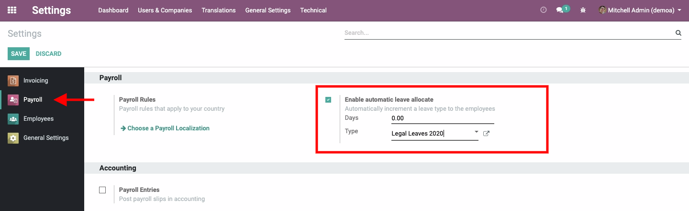

## Auto Leave Allocation
Automatically increment a leave type to the employees.

This will allow us, for example, to automatically add 1.25 days of vacation per
month to employees in accordance with Chilean legislation.

### How it works?
1. Just enable the **Enable automatic leave allocate** feature.

### Contributors
- **Alexander Olivares** - <aolivares@konos.cl>
- **Nelson Ramírez** - <nramirez@konos.cl>
